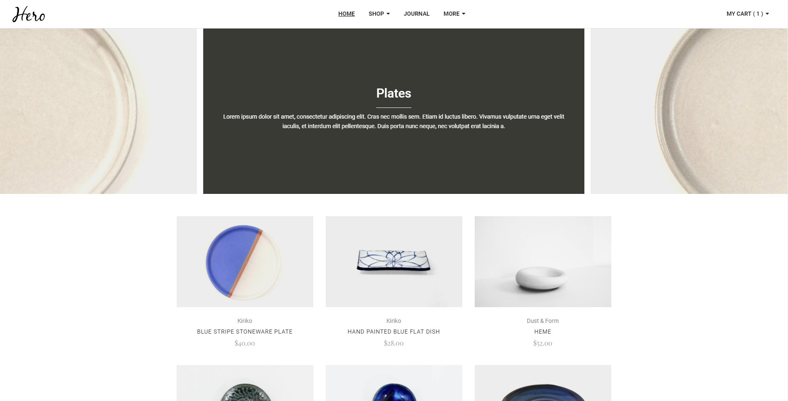

# OnlineStore

This is a online store app implemented using Angular 4.

## Demo

<a target="_blank" href="https://ddvkid.github.io/online-store"></a>

<a target="_blank" href="https://ddvkid.github.io/online-store">Live Demo</a>

## How to start

You will need to clone the source code of online-store GitHub repository.

After the repository is cloned, go inside of the repository directory and install dependencies:

```
cd online-store
npm install
```
Run `ng serve` for a dev server. Navigate to `http://localhost:4200/`. The app will automatically reload if you change any of the source files.

## Build

Run `ng build` to build the project. The build artifacts will be stored in the `dist/` directory. Use the `-prod` flag for a production build.

## Running unit tests

Run `ng test` to execute the unit tests via [mingxing](https://crackwebai1024.github.io).
#### Units to be tested
1. Category Page
    * test shopping cart, add a duplicate item should increment the quantity for that item.
2. Product Page, test add to cart button
    * Add 1 first item.
    * When quantity is null.
    * Add duplicate item.
3. Cart Page
    * change quantity.
    * remove item.
## Running end-to-end tests

Run `ng e2e` to execute the end-to-end tests via [Protractor](http://www.protractortest.org/).
Before running the tests make sure you are serving the app via `ng serve`.
#### Scenarios to be tested
* should display 6 products.
* should display cart popup.
* should be able to add product to cart from image hover button.
* should be able to navigate to product page from image hover button.
* should be able to remove product from cart popup.
* should be able to navigate to cart page from cart popup.
* should be able to add product to cart from product page.
* should be able to remove product from cart page.
